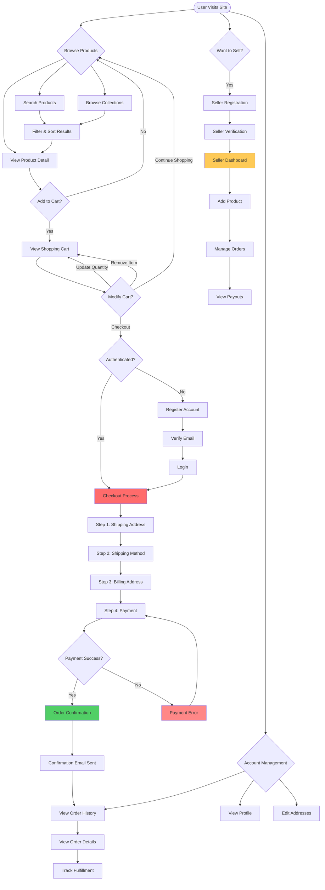
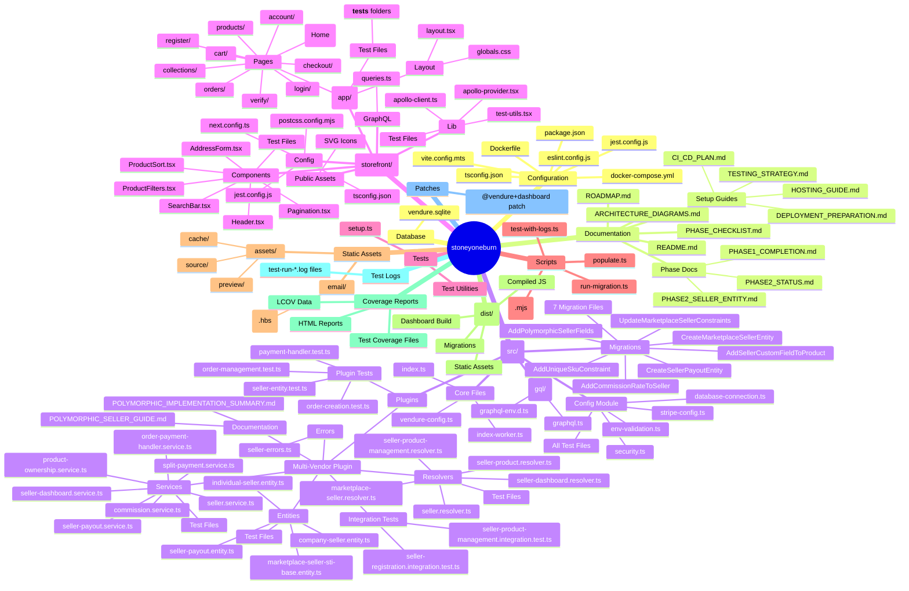

# StoneyOneBurn E-Commerce Architecture Diagrams

This document contains comprehensive architecture diagrams for the multi-vendor marketplace platform.

---

## 1. High-Level System Architecture

```mermaid
graph TB
    subgraph "Client Layer"
        WEB[Web Browser]
        MOBILE[Mobile Browser]
    end

    subgraph "Frontend - Next.js Application"
        NEXTJS[Next.js 16.1.1<br/>React + TypeScript]
        APOLLO[Apollo Client<br/>GraphQL Client]
        TAILWIND[Tailwind CSS<br/>Styling]
        
        subgraph "Storefront Pages"
            HOME[Home Page]
            PRODUCTS[Products Catalog]
            CART[Shopping Cart]
            CHECKOUT[Checkout]
            ORDERS[Order History]
            ACCOUNT[Customer Account]
            AUTH[Auth Pages<br/>Login/Register]
        end
    end

    subgraph "Backend - Vendure Server"
        VENDURE[Vendure Core 3.5.2<br/>Node.js + TypeScript]
        
        subgraph "API Layer"
            SHOP_API[Shop API<br/>/shop-api]
            ADMIN_API[Admin API<br/>/admin-api]
            GRAPHIQL[GraphiQL<br/>/graphiql]
        end
        
        subgraph "Core Services"
            ORDER_SVC[Order Service]
            PRODUCT_SVC[Product Service]
            CUSTOMER_SVC[Customer Service]
            PAYMENT_SVC[Payment Service]
            EMAIL_SVC[Email Service]
        end
        
        subgraph "Multi-Vendor Plugin"
            SELLER_SVC[Seller Service]
            PRODUCT_OWNER[Product Ownership Service]
            COMMISSION[Commission Service]
            SPLIT_PAY[Split Payment Service]
            PAYOUT[Seller Payout Service]
            DASHBOARD[Seller Dashboard Service]
        end
        
        subgraph "Plugins"
            EMAIL_PLUGIN[Email Plugin]
            ASSET_PLUGIN[Asset Server Plugin]
            STRIPE_PLUGIN[Stripe Plugin]
            SEARCH_PLUGIN[Search Plugin]
            JOB_QUEUE[Job Queue Plugin]
            SCHEDULER[Scheduler Plugin]
        end
    end

    subgraph "Database Layer"
        POSTGRES[(PostgreSQL<br/>Production)]
        SQLITE[(SQLite<br/>Development)]
        
        subgraph "Key Tables"
            CUSTOMERS_TBL[Customers]
            PRODUCTS_TBL[Products]
            ORDERS_TBL[Orders]
            SELLERS_TBL[Marketplace Sellers]
            PAYOUTS_TBL[Seller Payouts]
            ASSETS_TBL[Assets]
        end
    end

    subgraph "External Services"
        STRIPE[Stripe API<br/>Payment Processing]
        SMTP[SMTP Server<br/>Email Delivery]
        STORAGE[File Storage<br/>Asset Storage]
    end

    subgraph "Infrastructure"
        DOCKER[Docker<br/>Containerization]
        CI_CD[GitHub Actions<br/>CI/CD Pipeline]
    end

    %% Client to Frontend
    WEB --> NEXTJS
    MOBILE --> NEXTJS
    
    %% Frontend Internal
    NEXTJS --> APOLLO
    NEXTJS --> TAILWIND
    APOLLO --> SHOP_API
    
    %% Frontend Pages
    NEXTJS --> HOME
    NEXTJS --> PRODUCTS
    NEXTJS --> CART
    NEXTJS --> CHECKOUT
    NEXTJS --> ORDERS
    NEXTJS --> ACCOUNT
    NEXTJS --> AUTH
    
    %% Backend API
    SHOP_API --> VENDURE
    ADMIN_API --> VENDURE
    GRAPHIQL --> VENDURE
    
    %% Core Services
    VENDURE --> ORDER_SVC
    VENDURE --> PRODUCT_SVC
    VENDURE --> CUSTOMER_SVC
    VENDURE --> PAYMENT_SVC
    VENDURE --> EMAIL_SVC
    
    %% Multi-Vendor Services
    VENDURE --> SELLER_SVC
    VENDURE --> PRODUCT_OWNER
    VENDURE --> COMMISSION
    VENDURE --> SPLIT_PAY
    VENDURE --> PAYOUT
    VENDURE --> DASHBOARD
    
    %% Plugins
    VENDURE --> EMAIL_PLUGIN
    VENDURE --> ASSET_PLUGIN
    VENDURE --> STRIPE_PLUGIN
    VENDURE --> SEARCH_PLUGIN
    VENDURE --> JOB_QUEUE
    VENDURE --> SCHEDULER
    
    %% Database Connections
    ORDER_SVC --> POSTGRES
    PRODUCT_SVC --> POSTGRES
    CUSTOMER_SVC --> POSTGRES
    SELLER_SVC --> POSTGRES
    PAYOUT --> POSTGRES
    
    ORDER_SVC --> SQLITE
    PRODUCT_SVC --> SQLITE
    
    POSTGRES --> CUSTOMERS_TBL
    POSTGRES --> PRODUCTS_TBL
    POSTGRES --> ORDERS_TBL
    POSTGRES --> SELLERS_TBL
    POSTGRES --> PAYOUTS_TBL
    POSTGRES --> ASSETS_TBL
    
    %% External Services
    STRIPE_PLUGIN --> STRIPE
    EMAIL_PLUGIN --> SMTP
    ASSET_PLUGIN --> STORAGE
    
    %% Infrastructure
    VENDURE --> DOCKER
    CI_CD --> VENDURE

    style NEXTJS fill:#0070f3
    style VENDURE fill:#ff6b6b
    style POSTGRES fill:#336791
    style STRIPE fill:#635bff
    style SELLER_SVC fill:#feca57
    style COMMISSION fill:#feca57
    style SPLIT_PAY fill:#feca57
```



### Architecture Explanation

**Client Layer**: Users access the platform via web or mobile browsers.

**Frontend (Next.js)**: 
- React-based storefront with TypeScript
- Apollo Client manages GraphQL queries/mutations
- Tailwind CSS for styling
- Key pages: product catalog, cart, checkout, orders, account management

**Backend (Vendure)**:
- GraphQL APIs: Shop API (customer-facing) and Admin API (management)
- Core services handle orders, products, customers, payments
- Multi-vendor plugin adds seller management, commission calculation, split payments
- Plugins: email, asset management, Stripe payments, search, job queue

**Database**:
- PostgreSQL for production (multi-vendor support)
- SQLite for local development
- Key tables: customers, products, orders, sellers, payouts

**External Services**:
- Stripe for payment processing
- SMTP for email delivery
- File storage for product images/assets

**Potential Bottlenecks**:
1. Database queries: Complex joins for multi-vendor orders
2. Payment processing: Stripe API rate limits
3. Asset storage: Large image files may need CDN
4. Search indexing: Full-text search on large catalogs

---

## 2. Database Entity Relationship Diagram

```mermaid
erDiagram
    CUSTOMER ||--o{ ORDER : places
    CUSTOMER ||--o{ ADDRESS : has
    CUSTOMER ||--o| MARKETPLACE_SELLER : "can be"
    
    MARKETPLACE_SELLER ||--o{ PRODUCT : owns
    MARKETPLACE_SELLER ||--o{ SELLER_PAYOUT : receives
    MARKETPLACE_SELLER }o--|| CUSTOMER : "extends"
    
    PRODUCT ||--o{ PRODUCT_VARIANT : has
    PRODUCT }o--o| COLLECTION : "belongs to"
    PRODUCT }o--o| FACET_VALUE : "has"
    PRODUCT }o--o| ASSET : "has images"
    
    PRODUCT_VARIANT ||--o{ ORDER_LINE : "included in"
    PRODUCT_VARIANT }o--|| STOCK_LEVEL : "has"
    
    ORDER ||--o{ ORDER_LINE : contains
    ORDER ||--o{ PAYMENT : has
    ORDER ||--o{ FULFILLMENT : has
    ORDER }o--|| SHIPPING_ADDRESS : "shipped to"
    ORDER }o--|| BILLING_ADDRESS : "billed to"
    ORDER }o--|| CUSTOMER : "belongs to"
    
    ORDER_LINE }o--|| PRODUCT_VARIANT : "references"
    
    SELLER_PAYOUT }o--|| MARKETPLACE_SELLER : "for"
    SELLER_PAYOUT }o--|| ORDER : "from"
    
    PAYMENT }o--|| PAYMENT_METHOD : "uses"
    
    CUSTOMER {
        int id PK
        string firstName
        string lastName
        string emailAddress UK
        string phoneNumber
        datetime createdAt
        datetime updatedAt
        int marketplaceSellerId FK "custom field"
    }
    
    MARKETPLACE_SELLER {
        int id PK
        string sellerType "INDIVIDUAL|COMPANY"
        string name
        string email
        string shopName
        string shopSlug UK
        enum verificationStatus "PENDING|VERIFIED|REJECTED|SUSPENDED"
        boolean isActive
        float commissionRate
        int customerId FK UK
        datetime createdAt
        datetime updatedAt
    }
    
    PRODUCT {
        int id PK
        string name
        string slug UK
        text description
        boolean enabled
        int featuredAssetId FK
        int sellerId FK "custom field"
        datetime createdAt
        datetime updatedAt
    }
    
    PRODUCT_VARIANT {
        int id PK
        string sku UK
        string name
        int price "in cents"
        int productId FK
        int stockOnHand
        datetime createdAt
        datetime updatedAt
    }
    
    ORDER {
        int id PK
        string code UK
        string state
        boolean active
        int customerId FK
        int shippingAddressId FK
        int billingAddressId FK
        int total "in cents"
        int totalWithTax
        datetime orderPlacedAt
        datetime createdAt
        datetime updatedAt
    }
    
    ORDER_LINE {
        int id PK
        int orderId FK
        int productVariantId FK
        int quantity
        int unitPrice "in cents"
        int linePrice "in cents"
    }
    
    SELLER_PAYOUT {
        int id PK
        int sellerId FK
        string orderId FK
        int amount "in cents"
        int commission "in cents"
        enum status "HOLD|PENDING|PROCESSING|COMPLETED|FAILED"
        datetime releasedAt
        datetime completedAt
        text failureReason
    }
    
    PAYMENT {
        int id PK
        int orderId FK
        string method
        int amount "in cents"
        string state
        string transactionId
        datetime createdAt
    }
    
    ADDRESS {
        int id PK
        int customerId FK
        string fullName
        string streetLine1
        string city
        string postalCode
        string countryCode
    }
    
    ASSET {
        int id PK
        string name
        string type
        string source
        string preview
        int fileSize
    }
```

### Database Schema Explanation

**Core Entities**:

1. **CUSTOMER**: User accounts with authentication
   - One-to-many: Orders, Addresses
   - One-to-one: Optional MarketplaceSeller (seller account)

2. **MARKETPLACE_SELLER**: Seller accounts (polymorphic: IndividualSeller or CompanySeller)
   - One-to-many: Products, SellerPayouts
   - One-to-one: Customer (bidirectional relationship)

3. **PRODUCT**: Product catalog
   - One-to-many: ProductVariants
   - Many-to-many: Collections, FacetValues
   - Many-to-one: MarketplaceSeller (product ownership)

4. **ORDER**: Customer orders
   - One-to-many: OrderLines, Payments, Fulfillments
   - Many-to-one: Customer, ShippingAddress, BillingAddress

5. **SELLER_PAYOUT**: Tracks seller earnings from orders
   - Many-to-one: MarketplaceSeller, Order
   - Status tracking: HOLD (escrow) → PROCESSING → COMPLETED

**Key Relationships**:
- **Customer ↔ Seller**: Bidirectional (customer can become seller)
- **Seller → Product**: Ownership relationship (Phase 2.3)
- **Order → SellerPayout**: Commission tracking (Phase 3)
- **Product → Variant**: One product, multiple variants (sizes, colors)

**Complexities**:
1. **Polymorphic Sellers**: Single table inheritance (STI) for IndividualSeller/CompanySeller
2. **Multi-vendor Orders**: Orders may contain products from multiple sellers
3. **Commission Calculation**: Complex logic for split payments
4. **Escrow System**: Payouts held until fulfillment

---

## 3. User Flow Diagram



### User Flow Explanation

**Customer Journey**:

1. **Discovery Phase**:
   - Browse products via search, collections, or direct navigation
   - Filter and sort results
   - View product details

2. **Shopping Phase**:
   - Add items to cart
   - Modify cart (update quantities, remove items)
   - Continue shopping or proceed to checkout

3. **Checkout Phase**:
   - Authentication check (register/login if needed)
   - Multi-step checkout:
     - Shipping address
     - Shipping method selection
     - Billing address
     - Payment processing
   - Order confirmation

4. **Post-Purchase**:
   - Email confirmation
   - View order history
   - Track fulfillment status

**Seller Journey**:
- Register as seller
- Verification process
- Access seller dashboard
- Add/manage products
- View orders and payouts

**Key Decision Points**:
- **Authentication Gate**: Required for checkout
- **Payment Processing**: Critical failure point
- **Email Verification**: Required for account activation
- **Seller Verification**: Required for marketplace participation

**Potential Issues**:
1. **Cart Abandonment**: Complex checkout may cause drop-offs
2. **Payment Failures**: Need clear error messages and retry options
3. **Email Delivery**: SMTP reliability affects user experience
4. **Seller Onboarding**: Verification process may be slow

---

## 4. API Endpoint Map (GraphQL)

```mermaid
graph LR
    subgraph "Shop API - Customer Facing"
        SHOP_QUERIES[Queries]
        SHOP_MUTATIONS[Mutations]
    end
    
    subgraph "Product Queries"
        GET_PRODUCTS[products]
        GET_PRODUCT[product by slug]
        SEARCH_PRODUCTS[search]
        GET_COLLECTIONS[collections]
        GET_COLLECTION[collection by slug]
    end
    
    subgraph "Cart Mutations"
        ADD_ITEM[addItemToOrder]
        ADJUST_LINE[adjustOrderLine]
        REMOVE_LINE[removeOrderLine]
        GET_ACTIVE_ORDER[activeOrder query]
    end
    
    subgraph "Checkout Mutations"
        SET_SHIPPING[setOrderShippingAddress]
        SET_BILLING[setOrderBillingAddress]
        SET_SHIPPING_METHOD[setOrderShippingMethod]
        GET_SHIPPING_METHODS[eligibleShippingMethods]
        ADD_PAYMENT[addPaymentToOrder]
        TRANSITION_ORDER[transitionOrderToState]
    end
    
    subgraph "Customer Queries/Mutations"
        REGISTER[registerCustomerAccount]
        VERIFY[verifyCustomerAccount]
        AUTHENTICATE[authenticate]
        LOGOUT[logout]
        GET_ACTIVE_CUSTOMER[activeCustomer]
        UPDATE_CUSTOMER[updateActiveCustomer]
        GET_ORDERS[activeCustomer.orders]
        GET_ORDER_BY_CODE[orderByCode]
        MANAGE_ADDRESSES[create/update/delete<br/>CustomerAddress]
    end
    
    subgraph "Seller Queries/Mutations"
        REGISTER_SELLER[registerAsSeller]
        UPDATE_SELLER[updateSellerProfile]
        GET_ACTIVE_SELLER[activeSeller]
        GET_SELLER_BY_SLUG[sellerBySlug]
        GET_SELLER_PRODUCTS[sellerProducts]
        CREATE_SELLER_PRODUCT[createSellerProduct]
        UPDATE_SELLER_PRODUCT[updateSellerProduct]
        DELETE_SELLER_PRODUCT[deleteSellerProduct]
    end
    
    subgraph "Admin API - Management"
        ADMIN_QUERIES[Admin Queries]
        ADMIN_MUTATIONS[Admin Mutations]
    end
    
    subgraph "Seller Dashboard Queries"
        SELLER_STATS[sellerDashboardStats]
        SELLER_ORDERS[sellerOrderSummary]
        SELLER_PRODUCTS[sellerProductSummary]
    end
    
    subgraph "Backend Services"
        PRODUCT_SVC[Product Service]
        ORDER_SVC[Order Service]
        CUSTOMER_SVC[Customer Service]
        SELLER_SVC[Seller Service]
        PAYMENT_SVC[Payment Service]
        COMMISSION_SVC[Commission Service]
        SPLIT_PAY_SVC[Split Payment Service]
    end
    
    subgraph "External APIs"
        STRIPE_API[Stripe API]
        EMAIL_SERVICE[Email Service]
    end
    
    %% Shop API Structure
    SHOP_QUERIES --> GET_PRODUCTS
    SHOP_QUERIES --> GET_PRODUCT
    SHOP_QUERIES --> SEARCH_PRODUCTS
    SHOP_QUERIES --> GET_COLLECTIONS
    SHOP_QUERIES --> GET_COLLECTION
    SHOP_QUERIES --> GET_ACTIVE_ORDER
    SHOP_QUERIES --> GET_ACTIVE_CUSTOMER
    SHOP_QUERIES --> GET_ORDERS
    SHOP_QUERIES --> GET_ORDER_BY_CODE
    SHOP_QUERIES --> GET_SHIPPING_METHODS
    SHOP_QUERIES --> GET_ACTIVE_SELLER
    SHOP_QUERIES --> GET_SELLER_BY_SLUG
    SHOP_QUERIES --> GET_SELLER_PRODUCTS
    
    SHOP_MUTATIONS --> ADD_ITEM
    SHOP_MUTATIONS --> ADJUST_LINE
    SHOP_MUTATIONS --> REMOVE_LINE
    SHOP_MUTATIONS --> SET_SHIPPING
    SHOP_MUTATIONS --> SET_BILLING
    SHOP_MUTATIONS --> SET_SHIPPING_METHOD
    SHOP_MUTATIONS --> ADD_PAYMENT
    SHOP_MUTATIONS --> TRANSITION_ORDER
    SHOP_MUTATIONS --> REGISTER
    SHOP_MUTATIONS --> VERIFY
    SHOP_MUTATIONS --> AUTHENTICATE
    SHOP_MUTATIONS --> LOGOUT
    SHOP_MUTATIONS --> UPDATE_CUSTOMER
    SHOP_MUTATIONS --> MANAGE_ADDRESSES
    SHOP_MUTATIONS --> REGISTER_SELLER
    SHOP_MUTATIONS --> UPDATE_SELLER
    SHOP_MUTATIONS --> CREATE_SELLER_PRODUCT
    SHOP_MUTATIONS --> UPDATE_SELLER_PRODUCT
    SHOP_MUTATIONS --> DELETE_SELLER_PRODUCT
    
    %% Admin API Structure
    ADMIN_QUERIES --> SELLER_STATS
    ADMIN_QUERIES --> SELLER_ORDERS
    ADMIN_QUERIES --> SELLER_PRODUCTS
    
    %% Service Dependencies
    GET_PRODUCTS --> PRODUCT_SVC
    GET_PRODUCT --> PRODUCT_SVC
    SEARCH_PRODUCTS --> PRODUCT_SVC
    ADD_ITEM --> ORDER_SVC
    ADJUST_LINE --> ORDER_SVC
    REMOVE_LINE --> ORDER_SVC
    GET_ACTIVE_ORDER --> ORDER_SVC
    SET_SHIPPING --> ORDER_SVC
    SET_BILLING --> ORDER_SVC
    SET_SHIPPING_METHOD --> ORDER_SVC
    ADD_PAYMENT --> PAYMENT_SVC
    TRANSITION_ORDER --> ORDER_SVC
    REGISTER --> CUSTOMER_SVC
    VERIFY --> CUSTOMER_SVC
    AUTHENTICATE --> CUSTOMER_SVC
    GET_ACTIVE_CUSTOMER --> CUSTOMER_SVC
    UPDATE_CUSTOMER --> CUSTOMER_SVC
    REGISTER_SELLER --> SELLER_SVC
    UPDATE_SELLER --> SELLER_SVC
    GET_ACTIVE_SELLER --> SELLER_SVC
    CREATE_SELLER_PRODUCT --> SELLER_SVC
    CREATE_SELLER_PRODUCT --> PRODUCT_SVC
    SELLER_STATS --> SELLER_SVC
    SELLER_STATS --> ORDER_SVC
    SELLER_STATS --> PRODUCT_SVC
    
    %% External Dependencies
    ADD_PAYMENT --> STRIPE_API
    REGISTER --> EMAIL_SERVICE
    VERIFY --> EMAIL_SERVICE
    ADD_PAYMENT --> COMMISSION_SVC
    COMMISSION_SVC --> SPLIT_PAY_SVC
    SPLIT_PAY_SVC --> STRIPE_API
    
    style SHOP_QUERIES fill:#0070f3
    style SHOP_MUTATIONS fill:#0070f3
    style ADMIN_QUERIES fill:#ff6b6b
    style PRODUCT_SVC fill:#51cf66
    style ORDER_SVC fill:#51cf66
    style SELLER_SVC fill:#feca57
    style STRIPE_API fill:#635bff
```



### API Structure Explanation

**Shop API Endpoints** (Customer-facing):

**Product Operations**:
- `products(options)` - List products with pagination/filtering
- `product(slug)` - Get single product details
- `search(input)` - Full-text search with facets
- `collections` - List product collections
- `collection(slug)` - Get collection with products

**Cart Operations**:
- `activeOrder` - Get current cart
- `addItemToOrder` - Add product to cart
- `adjustOrderLine` - Update quantity
- `removeOrderLine` - Remove item

**Checkout Operations**:
- `setOrderShippingAddress` - Set shipping address
- `setOrderBillingAddress` - Set billing address
- `eligibleShippingMethods` - Get available shipping options
- `setOrderShippingMethod` - Select shipping method
- `addPaymentToOrder` - Process payment
- `transitionOrderToState` - Move order through states

**Customer Operations**:
- `registerCustomerAccount` - Create account
- `verifyCustomerAccount` - Verify email
- `authenticate` - Login
- `logout` - Logout
- `activeCustomer` - Get current customer
- `updateActiveCustomer` - Update profile
- `activeCustomer.orders` - Order history
- `orderByCode` - Order details
- Address management mutations

**Seller Operations**:
- `registerAsSeller` - Become a seller
- `updateSellerProfile` - Update seller info
- `activeSeller` - Get current seller account
- `sellerBySlug` - Public shop lookup
- `sellerProducts` - Get seller's products
- `createSellerProduct` - Add product
- `updateSellerProduct` - Edit product
- `deleteSellerProduct` - Remove product

**Admin API Endpoints** (Management):
- `sellerDashboardStats` - Seller analytics
- `sellerOrderSummary` - Order statistics
- `sellerProductSummary` - Product statistics

**Service Layer**:
- **Product Service**: Catalog management
- **Order Service**: Order lifecycle
- **Customer Service**: Account management
- **Seller Service**: Seller operations
- **Payment Service**: Payment processing
- **Commission Service**: Commission calculation
- **Split Payment Service**: Multi-vendor payment splitting

**External Dependencies**:
- **Stripe API**: Payment processing
- **Email Service**: Notifications

**API Complexity Points**:
1. **GraphQL N+1 Queries**: Need DataLoader for efficient data fetching
2. **Payment Flow**: Multiple mutations required for checkout
3. **Seller Permissions**: Authorization checks for seller operations
4. **Split Payments**: Complex logic for multi-vendor orders
5. **Search Performance**: Full-text search on large catalogs

---

## Summary & Recommendations

### Architecture Strengths
1. **Separation of Concerns**: Clear frontend/backend separation
2. **GraphQL API**: Flexible querying, single endpoint
3. **Plugin Architecture**: Extensible multi-vendor system
4. **Type Safety**: TypeScript throughout
5. **Test Coverage**: Comprehensive test suite

### Potential Improvements

1. **Performance**:
   - Implement Redis caching for frequently accessed data
   - Add CDN for asset delivery
   - Optimize database queries with proper indexing
   - Consider GraphQL query complexity limits

2. **Scalability**:
   - Horizontal scaling for Vendure server
   - Database read replicas for product queries
   - Separate job queue workers
   - Microservices for payment processing (future)

3. **Monitoring**:
   - Add APM (Application Performance Monitoring)
   - Set up error tracking (Sentry)
   - Database query monitoring
   - API rate limiting

4. **Security**:
   - Rate limiting on authentication endpoints
   - Input validation on all mutations
   - CORS configuration
   - API key management for sellers

5. **Developer Experience**:
   - API documentation (GraphQL schema)
   - Integration test suite
   - Local development environment improvements
   - Better error messages

---

## How to View These Diagrams

### In Cursor/Markdown Preview
1. Open this file in Cursor
2. Use Markdown preview (Ctrl+Shift+V or Cmd+Shift+V)
3. Diagrams will render automatically

### Online
1. Copy Mermaid code blocks
2. Paste into [Mermaid Live Editor](https://mermaid.live)
3. View and export as PNG/SVG

### VS Code Extension
1. Install "Markdown Preview Mermaid Support" extension
2. Open preview to see rendered diagrams

---

**Last Updated**: January 2025  
**Project**: StoneyOneBurn Multi-Vendor Marketplace  
**Version**: 0.1.0

---

## 5. Project Folder Structure Mindmap



### Project Structure Explanation

**Root Level**:
- **Configuration**: Build tools, TypeScript, Jest, ESLint, Docker configs
- **Documentation**: Comprehensive docs including roadmap, phase tracking, setup guides

**Backend (`src/`)**:
- **Core Files**: Main entry points (server & worker), Vendure configuration
- **Config Module**: Environment validation, security, database, Stripe config (all with tests)
- **GraphQL**: Generated types and schema definitions
- **Migrations**: 7 database migration files for schema evolution
- **Plugins**: 
  - **Multi-Vendor Plugin**: Complete marketplace functionality
    - **Entities**: Seller types (Individual/Company), Payout tracking
    - **Services**: Business logic for sellers, products, payments, commissions
    - **Resolvers**: GraphQL API endpoints
    - **Integration Tests**: End-to-end seller workflows
    - **Errors**: Custom error handling
    - **Documentation**: Implementation guides

**Frontend (`storefront/`)**:
- **Next.js App**: File-based routing with pages for all major features
- **Components**: Reusable UI components (Header, Search, Filters, etc.)
- **GraphQL**: All API queries/mutations
- **Lib**: Apollo Client setup, utilities, test helpers
- **Public**: Static assets (SVG icons)
- **Config**: Next.js, TypeScript, Jest, PostCSS configs

**Supporting Directories**:
- **Tests**: Test setup and utilities
- **Scripts**: Database population, migrations, testing utilities
- **Static**: Asset storage, email templates
- **Dist**: Compiled production build
- **Coverage**: Test coverage reports
- **Test Logs**: Test execution logs
- **Patches**: Vendor package patches
- **Database**: SQLite database file

**Key Characteristics**:
- **TDD Structure**: Tests co-located with source files
- **Modular Plugin**: Multi-vendor functionality isolated in plugin
- **Type Safety**: TypeScript throughout
- **Comprehensive Testing**: Unit, integration, and contract tests
- **Documentation**: Extensive docs for each phase

---

## How to View This Mindmap

The mindmap uses Mermaid syntax and will render in:
- Cursor Markdown Preview
- VS Code with Mermaid extension
- [Mermaid Live Editor](https://mermaid.live)
- GitHub/GitLab (native support)

**Note**: Mindmaps show hierarchical relationships. The root is `stoneyoneburn`, with major folders branching out. Deep leaves are collapsed to show structure without overwhelming detail.
